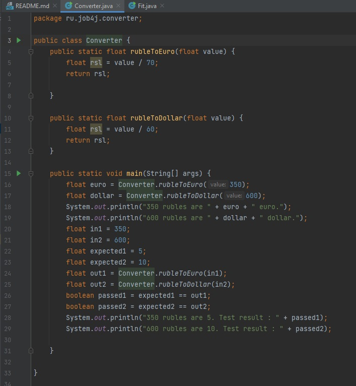

# Job4j. Блок базовый синтаксис.
Проект содержит решения блока "Базовый синтаксис" курса Job4j.
В этом проекте рассмотрены: 
- переменные
- операторы ветвления
- циклы
- массивы
- модульное тестирование
- IDEA
- Основы GIT

## Ниже примеры работ по данному курсу.

1. ### Фитнес калькулятор.

2. ### Конвертер валют.

